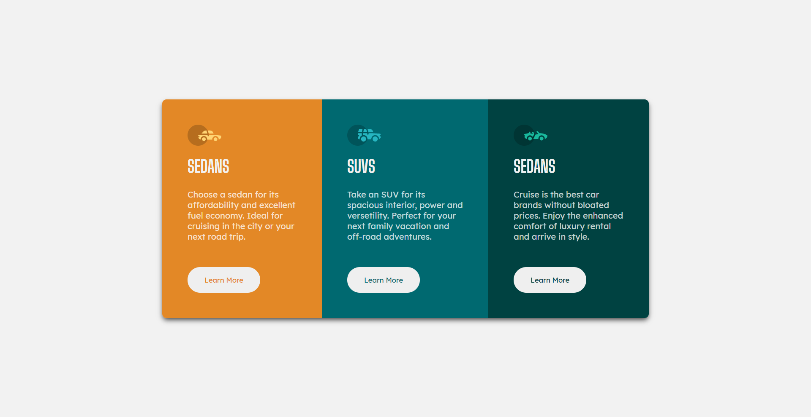

# Frontend Mentor - 3-column preview card component solution

This is a solution to the [3-column preview card component challenge on Frontend Mentor](https://www.frontendmentor.io/challenges/3column-preview-card-component-pH92eAR2-). Frontend Mentor challenges help you improve your coding skills by building realistic projects.

## Table of contents

- [Overview](#overview)
  - [The challenge](#the-challenge)
  - [Screenshot](#screenshot)
  - [Links](#links)
- [My process](#my-process)
  - [Built with](#built-with)
  - [What I learned](#what-i-learned)
  - [Continued development](#continued-development)
  - [Useful resources](#useful-resources)
- [Author](#author)
- [Acknowledgments](#acknowledgments)

**Note: Delete this note and update the table of contents based on what sections you keep.**

## Overview

### The challenge

Users should be able to:

- View the optimal layout depending on their device's screen size
- See hover states for interactive elements

### Screenshot

#### Desktop

#### Mobile

### Links

- Live Site URL: [Live site URL](https://saurabh1996-rex.github.io/3-column-preview-card-component/)

## My process

### Built with

- [React](https://reactjs.org/) - JS library

### What I learned

I was able to use React JS for an independant project and make it look as close to the design as possible. I'm completely aware that this isn't the capability of React JS , however; I'll be improving my skills throughout.

### Continued development

I'll be continuing my journey using React JS and improving on the skills I'll also try building more complex landing pages using React making use of its properties.

### Useful resources

- [React JS Docs](https://reactjs.org/docs/getting-started.html) - This helped me for starting out with React JS and also this helped me a lot in understanding more about the deploying techinques.

## Author

- Frontend Mentor - [@saurabh1996-rex](https://www.frontendmentor.io/profile/saurabh1996-rex)

## Acknowledgments

Always thankful to Frontendmentor.io as they've provided all the necessary files so that it was easier to work with the project. Also special metion to the one who have designed this project, Great Work!
